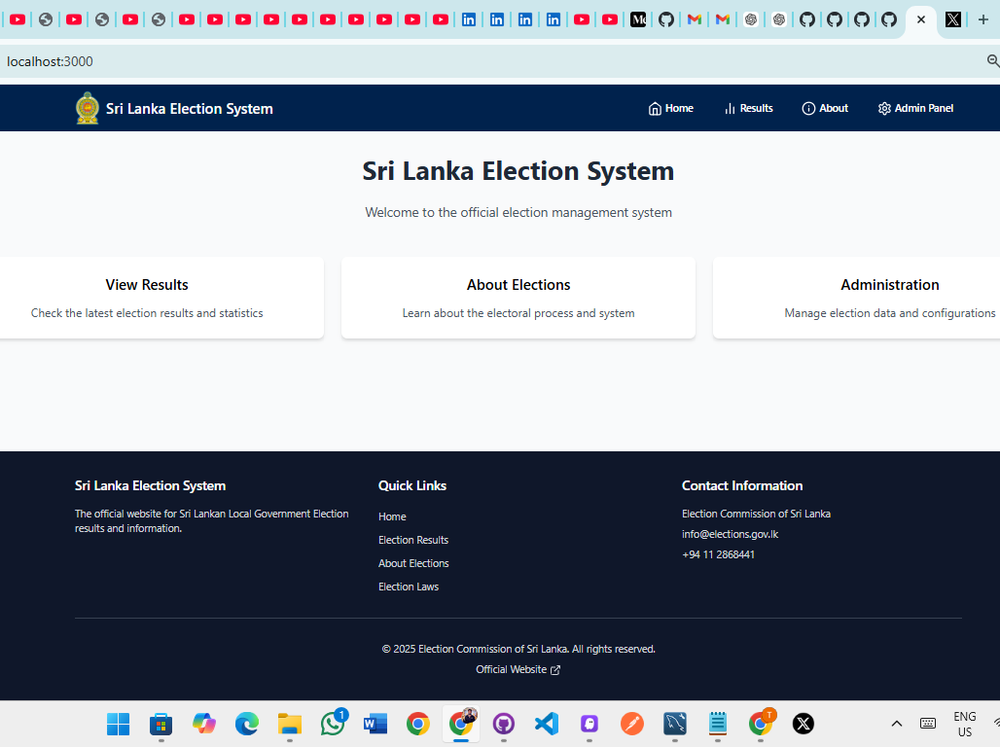
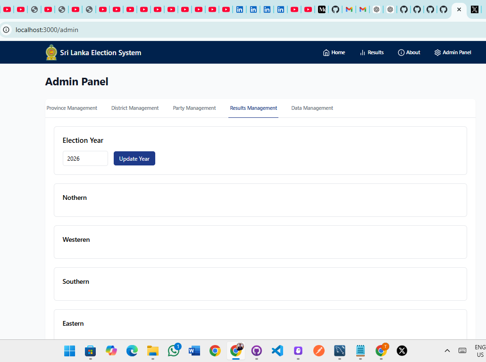
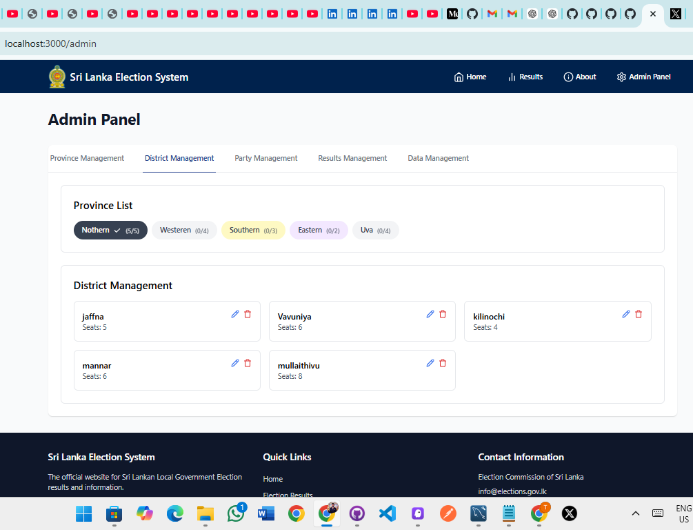
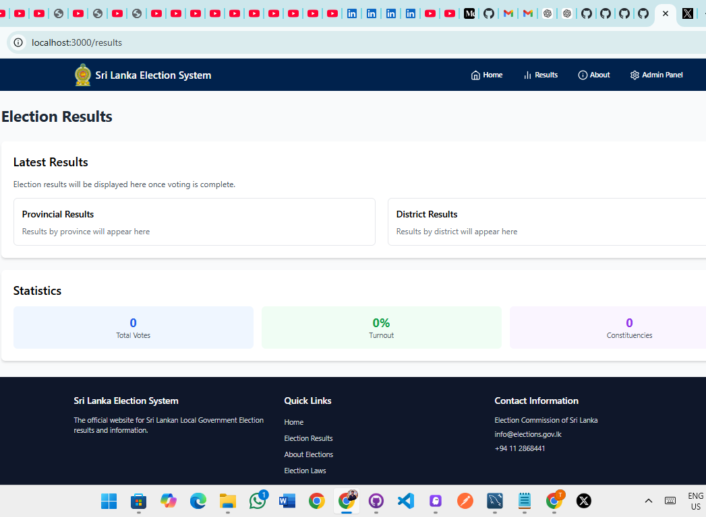
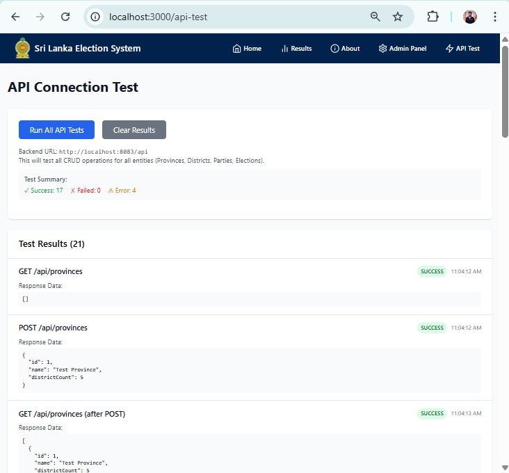

# 🇱🇰 Sri Lanka Election System

A comprehensive full-stack election management system built with **React** (Frontend) and **Spring Boot** (Backend). This system provides complete election administration capabilities including province management, district management, party registration, and real-time results tracking.

## 📋 Features

- **🏛️ Province Management** - Create, update, and manage provinces with district counts
- **🏘️ District Management** - Manage districts within provinces with seat allocations
- **🎯 Party Management** - Register and manage political parties
- **🗳️ Election Management** - Set up and manage election years
- **📊 Results Management** - Track and display election results
- **🔧 Admin Panel** - Complete administrative interface
- **🧪 API Testing** - Built-in API connectivity testing tool

## 🛠️ Technology Stack

### Frontend
- **React 18** with TypeScript
- **Tailwind CSS** for styling
- **React Router** for navigation
- **Lucide React** for icons
- **Chart.js** for data visualization
- **Vite** for build tooling

### Backend
- **Spring Boot 3.5.0** with Java 21
- **Spring Data JPA** for database operations
- **H2 Database** (in-memory for development)
- **Hibernate** for ORM
- **Maven** for dependency management
- **Lombok** for code generation

### Database
- **H2 In-Memory Database** (Development)
- **MySQL Support** (Production ready)

## 🚀 Getting Started

### Prerequisites
- **Java 21** or higher
- **Node.js 18** or higher
- **npm** or **yarn**

### 🔧 Backend Setup

1. Navigate to the backend directory:
```bash
cd backend/java
```

2. Install dependencies and run the application:
```bash
./mvnw spring-boot:run
```

The backend will start on **http://localhost:8083**

### 🎨 Frontend Setup

1. Navigate to the frontend directory:
```bash
cd frontend/React/project
```

2. Install dependencies:
```bash
npm install
```

3. Start the development server:
```bash
npm run dev
```

The frontend will start on **http://localhost:3000**

## 📡 API Endpoints

### Provinces
- `GET /api/provinces` - Get all provinces
- `POST /api/provinces` - Create new province
- `GET /api/provinces/{id}` - Get province by ID
- `PUT /api/provinces/{id}` - Update province
- `DELETE /api/provinces/{id}` - Delete province

### Districts
- `GET /api/districts` - Get all districts
- `POST /api/districts` - Create new district
- `GET /api/districts/{id}` - Get district by ID
- `DELETE /api/districts/{id}` - Delete district

### Parties
- `GET /api/parties` - Get all parties
- `POST /api/parties` - Create new party
- `GET /api/parties/{id}` - Get party by ID
- `DELETE /api/parties/{id}` - Delete party

### Elections
- `GET /api/elections` - Get all elections
- `POST /api/elections` - Create new election
- `GET /api/elections/{id}` - Get election by ID
- `DELETE /api/elections/{id}` - Delete election

## 🗄️ Database Schema

The system uses the following main entities:

- **Province** - Stores province information with district counts
- **District** - Stores district details linked to provinces
- **Party** - Stores political party information
- **Election** - Stores election year information

## 📸 Application Screenshots

### 🏠 Home Page

*Welcome page with navigation to different sections*

### 🔧 Admin Panel - Province Management

*Administrative interface for managing provinces*

### 🏘️ District Management

*Interface for managing districts within provinces*

### 📊 Election Results

*Election results display with statistics*

### 🧪 API Testing Tool

*Built-in tool for testing API connectivity and functionality*

## 🧪 Testing

The application includes a comprehensive API testing tool accessible at `/api-test`. This tool tests all CRUD operations across all entities and provides detailed feedback on API connectivity.

### Running API Tests
1. Start both backend and frontend servers
2. Navigate to `http://localhost:3000/api-test`
3. Click "Run All API Tests"
4. View detailed results for each endpoint

## 🏗️ Project Structure

```
├── backend/
│   └── java/
│       ├── src/main/java/com/election/project/
│       │   ├── controller/     # REST Controllers
│       │   ├── dto/           # Data Transfer Objects
│       │   ├── entity/        # JPA Entities
│       │   ├── repository/    # Data Repositories
│       │   └── service/       # Business Logic
│       └── src/main/resources/
│           └── application.properties
├── frontend/
│   └── React/project/
│       ├── src/
│       │   ├── components/    # Reusable Components
│       │   ├── context/       # React Context
│       │   ├── pages/         # Page Components
│       │   └── App.tsx
│       └── package.json
└── README.md
```

## 🔧 Configuration

### Backend Configuration
The backend is configured via `application.properties`:
- Server runs on port **8083**
- H2 database with console access at `/h2-console`
- CORS enabled for frontend integration

### Frontend Configuration
- Vite development server on port **3000**
- API base URL: `http://localhost:8083/api`
- Tailwind CSS for styling

## 🚀 Deployment

### Backend Deployment
```bash
cd backend/java
./mvnw clean package
java -jar target/project-0.0.1-SNAPSHOT.jar
```

### Frontend Deployment
```bash
cd frontend/React/project
npm run build
# Deploy the dist/ folder to your web server
```

## 🤝 Contributing

1. Fork the repository
2. Create a feature branch (`git checkout -b feature/amazing-feature`)
3. Commit your changes (`git commit -m 'Add some amazing feature'`)
4. Push to the branch (`git push origin feature/amazing-feature`)
5. Open a Pull Request

## 📄 License

This project is licensed under the MIT License - see the [LICENSE](LICENSE) file for details.

## ☕ Support

If this project helped you, consider buying me a coffee! ☕

[](https://buymeacoffee.com/yourhandle)

## 📞 Contact

For questions or support, please contact:
- **Email**: info@elections.gov.lk
- **Phone**: +94 11 2868441

---

**© 2026 Election Commission of Sri Lanka. All rights reserved.**